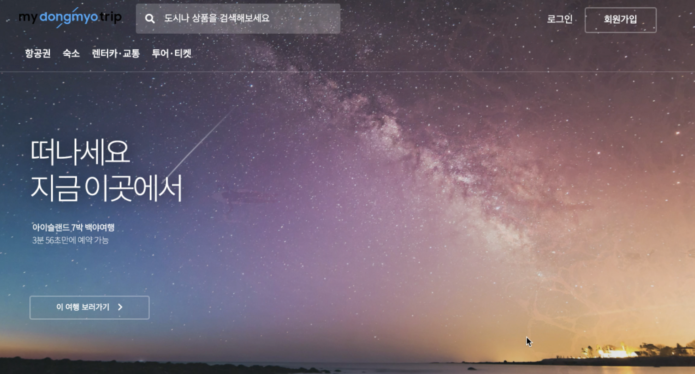
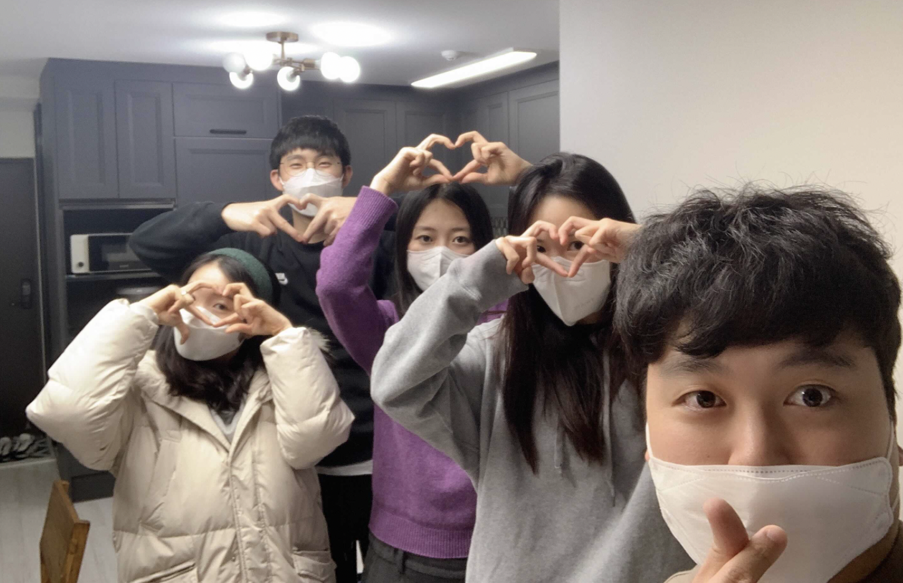

# 프로젝트 소개

⛩ 국내 최고의 여행플랫폼인 마이리얼트립 사이트를 클론 했습니다.

## 👨‍👩‍👧‍👦 팀원

프론트 개발자 3명, 백엔드 개발자 2명

## 📅 개발 기간

- 기간: 2020.12.28 ~ 2021.01.08 (11일)

## 🧑‍💻 적용 기술

- HTML/CSS, JavaScript, React(CRA), React-router, Styled-Components, Hooks
- **협업도구**: Git, Github, Trello, Slack

## 📍사이트 구현 플로우

회원가입(일반/카카오) > 로그인 > 메인페이지 > 항공예약페이지 > 숙박 메인페이지 > 숙박 상세페이지

# 💁‍♀️ 담당 및 구현기능

- [마이리얼트립 클론 프로젝트 코드정리 바로가기](https://velog.io/@dev_cecy/%EB%A7%88%EC%9D%B4%EB%A6%AC%EC%96%BC%ED%8A%B8%EB%A6%BD-%ED%81%B4%EB%A1%A0-%ED%94%84%EB%A1%9C%EC%A0%9D%ED%8A%B8-%ED%9A%8C%EA%B3%A0%EB%A1%9D)

1. **숙소 메인페이지**

- 레이아웃 완벽구현

2.  **숙소 리스트**

- 백엔드 데이터를 이용한 숙소 리스트페이지 구현
- 상단 메뉴 날짜선택창, 인원수 체크박스 구현
- 쿼리스트링을 통한 좌측 모든 필터기능 구현
- 하단 페이지네이션 구현

3. **숙소 상세 페이지**

- 백엔드 데이터를 이용한 숙소 상세페이지 구현
- 상단 메뉴 날짜 선택창, 인원수 체크박스 구현
- 지도보기 클릭시 새탭으로 보기 구현
- 상세정보 더보기 구현
- 위시리스트 모달창 좋아요 클릭기능
- 숙소 선택시 모달창에 정보 업데이트 기능 구현

#### 기타 구현 사항

- styled component 사용시 globalStyles.js , theme,js 를 통한 통일적인 레이아웃 구현

## 🎥 영상

- [마이리얼트립 클론 프로젝트 회고록 바로가기](https://velog.io/@dev_cecy/%EB%A7%88%EC%9D%B4%EB%A6%AC%EC%96%BC%ED%8A%B8%EB%A6%BD-%ED%81%B4%EB%A1%A0-%ED%94%84%EB%A1%9C%EC%A0%9D%ED%8A%B8-%ED%9A%8C%EA%B3%A0%EB%A1%9D)
- [마이리얼트립 클론 프로젝트 영상 바로가기](https://youtu.be/Ni-htqkWnf4)

## 💎 레퍼런스

- 이 프로젝트는 [MyRealTrip](https://www.myrealtrip.com/) 사이트를 참조하여 학습목적으로 만들었습니다.
- 실무수준의 프로젝트이지만 학습용으로 만들었기 때문에 이 코드를 활용하여 이득을 취하거나 무단 배포할 경우 법적으로 문제될 수 있습니다.
- 이 프로젝트에서 사용하고 있는 사진 일부분은 위코드에서 구매한 것 이므로 해당 프로젝트 외부인이 사용할 수 없습니다.
